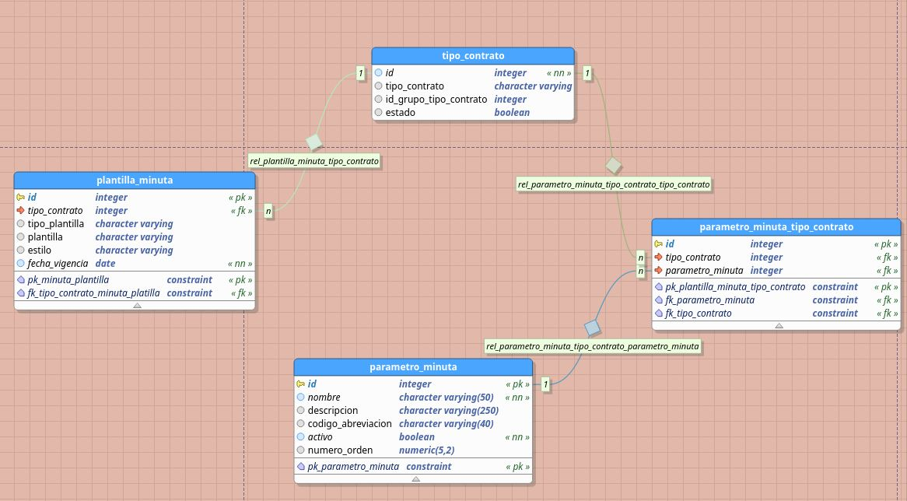

# minutas_argo_crud

**minutas_argo_crud**, CRUD para la gestion de plantillas de Argo. El proyecto está escrito en el lenguaje Go, generado mediante el **[framework beego](https://beego.me/)**.

### Modelo de Datos


### Base de datos.

La base de datos ya esta desplegada en local de la ofinina para usarla y conectarse se deben solicitar las credenciales respectivas.

## Requerimientos

- [Postgres](https://www.postgresql.org/)

 - [Golang](https://github.com/udistrital/introduccion_oas/blob/master/instalacion_de_herramientas/golang.md)

- [Beego y Bee](https://github.com/udistrital/introduccion_oas/blob/master/instalacion_de_herramientas/beego.md)

# Ejecucion del proyecto

para ejecutar el proyecto no es suficiente con `bee run` es necesario un cuerpo de ejecucion en el cual se ingresen los valores de las variables necesarias


```javascript
MINUTAS_ARGO_CRUD_DB_NAME=[nombre de la base de datos] MINUTAS_ARGO_CRUD_DB_PASS=[contraseña de acceso] MINUTAS_ARGO_CRUD_DB_URL=[url o host de la base de datos] MINUTAS_ARGO_CRUD_DB_USER=[usuario con permisos sobre la base de datos] MINUTAS_ARGO_CRUD_HTTP_PORT=[puerto por el que se escuchara] bee run -downdoc=true -gendoc=true
```


### EndPoints

Cada tabla tiene sus metodos 

- GetAll
- GetOne
- Put
- Delete

dependiendo de cualquiera usar lo define al momento de consumir el servicio, los endpoint a los cuales apuntar son los siguientes:

||End Point|
|----------------|------------------------|
| **parametro_minuta** | `[host de la maquina]:[puerto]/v1/parametro_minuta` |
| **parametro_minuta_tipo_contrato** | `[host de la maquina]:[puerto]/v1/parametro_minuta_tipo_contrato`|
| **tipo_contrato** | `[host de la maquina]:[puerto]/v1/tipo_contrato` |
| **plantilla_minuta** | `[host de la maquina]:[puerto]/v1/plantilla_minuta` |
